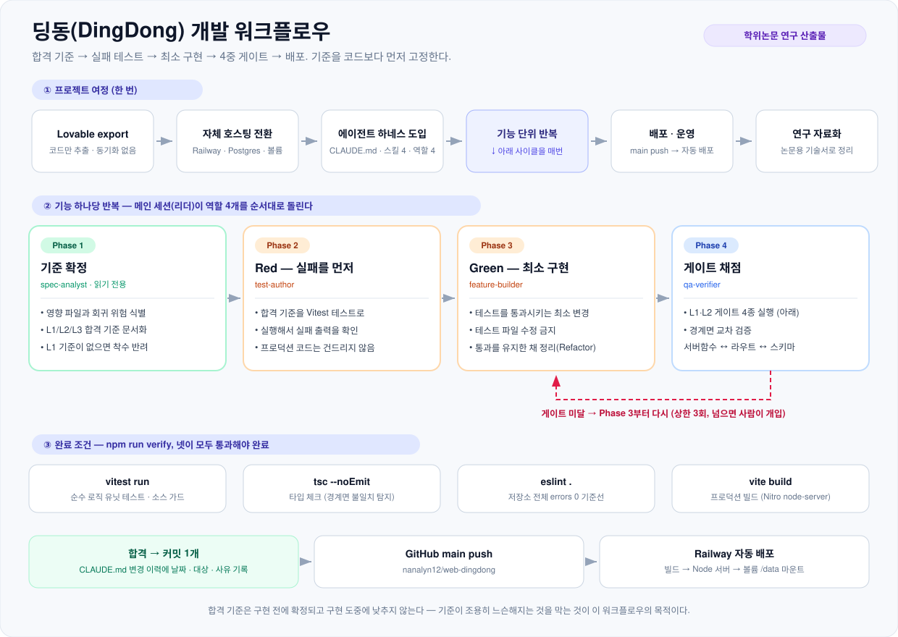

# DingDong(딩동) — AI 생성 콘텐츠 기반 중국어 학습 웹앱

> 🎓 **이 저장소는 학위논문 연구 산출물입니다.**
> 상업 서비스가 아니라, **연구 목적으로 설계·구현된 웹 학습 플랫폼의 전체 소스**이며
> 연구의 투명성과 재현 가능성을 위해 공개되었습니다. → [연구 산출물 안내](#연구-산출물-안내)

한국인 중국어 학습자를 위한 웹 학습 플랫폼입니다. **생성형 AI가 학습 콘텐츠(학습 영상·학습송)를 자동으로 제작**하고,
그 콘텐츠에서 학습자가 저장한 **어휘를 간격 반복(SRS)으로 복습**시킵니다.
코스/레슨, 드라마·노래 기반 학습, 단어장 SRS 복습, 웹 푸시 알림을 제공합니다.

> 📖 **비개발자용 기능 소개 + 영상·학습송 생성 로직**은 [소개.md](소개.md)를 참고하세요.
> 이 README는 개발·운영(로컬 개발, DB, 배포)에 집중합니다.

- **프론트/서버**: TanStack Start (React 19, SSR) + Vite + Nitro(Node 서버)
- **DB**: Railway Postgres + Drizzle ORM (스키마: [src/db/schema.ts](src/db/schema.ts), 마이그레이션: `drizzle/`)
- **인증**: better-auth (아이디/비밀번호 + Google OAuth), 세션 쿠키 방식. 역할: 학생 / 교수자 / admin
- **미디어**: Suno 음원/영상·레슨 이미지를 Railway 볼륨(`/data`)에 저장, `/media/*` 라우트로 서빙
- **AI**: Google Gemini API (드라마 생성, 레슨 이미지, 가사 병음·번역, 영상 대본), Suno(노래 생성)
- **UI**: Tailwind 4 + shadcn/ui, **모바일 우선**(폰 값이 기본, `md:`로 데스크톱 복원)
- **배포**: GitHub → Railway 자동 배포

## 연구 산출물 안내

이 프로젝트는 **학위논문 연구를 위해 개발된 시스템**이며, 저장소 공개 역시 연구의 일부입니다.

| 항목            | 내용                                                                                                                             |
| --------------- | -------------------------------------------------------------------------------------------------------------------------------- |
| **성격**        | 학위논문 연구 산출물 (research artifact). 상용 제품·서비스가 아닙니다.                                                            |
| **연구 목적**   | 생성형 AI로 어학 학습 콘텐츠(영상·학습송)를 자동 제작하고, 거기서 수집된 어휘를 간격 반복(SRS)으로 잇는 통합 학습 시스템의 설계·구현·검증 |
| **공개 이유**   | 논문 심사·검증, 재현 가능성 확보, 후속 연구자의 참고                                                                              |
| **연구 문서**   | [write.md](write.md) — 논문용 상세 기술서(설계 근거·파일 경로 대조) · [소개.md](소개.md) — 기능 소개 · [CLAUDE.md](CLAUDE.md) — 변경 이력 |
| **개발 방식**   | 프롬프트 기반 에이전트 하네스(아래 [개발 워크플로우](#개발-워크플로우)). 이 개발 프로세스 자체도 논문의 서술 대상입니다.           |

- 운영 인스턴스의 **학습 데이터·계정 정보는 이 저장소에 포함되어 있지 않습니다.** API 키·비밀값(`.env`)도 커밋하지 않습니다([`.env.example`](.env.example) 참고).
- 앱이 만들어 내는 학습 콘텐츠는 **생성형 AI의 산출물**이므로 오류가 있을 수 있습니다. 실제 교육 현장에 쓰려면 교수자 검수가 필요합니다.
- 외부 유료 API(Gemini·Suno·Google TTS·Pexels)를 사용하므로, 직접 구동하려면 **본인 키와 비용**이 필요합니다.
- 인용·재사용·협업 문의는 이 저장소의 Issues로 남겨 주세요.

## 개발 워크플로우

이 앱은 **"합격 기준 먼저 → 실패 확인 → 최소 구현 → 4중 게이트 통과"** 순서로 개발되었습니다.
기능 하나하나가 아래 사이클을 한 번씩 통과했고, **합격 기준은 구현 도중에 낮추지 않습니다.**



| 단계                    | 담당              | 하는 일                                              | 산출물                                       |
| ----------------------- | ----------------- | ---------------------------------------------------- | -------------------------------------------- |
| **Phase 1** 기준 확정   | `spec-analyst`    | 영향 파일·회귀 위험 식별, L1/L2/L3 합격 기준 작성    | `_workspace/01_spec-analyst_criteria.md`      |
| **Phase 2** Red         | `test-author`     | 기준을 Vitest 테스트로 옮기고 **실패를 먼저 확인**    | `src/**/*.test.ts`, `02_test-author_red-report.md` |
| **Phase 3** Green       | `feature-builder` | 테스트를 통과시키는 최소 구현 (테스트 파일 수정 금지) | 구현 코드, `03_feature-builder_evidence.md`   |
| **Phase 4** 게이트 채점 | `qa-verifier`     | 게이트 4종 실행 + 경계면 교차 검증                    | `04_qa-verifier_verdict.md` 또는 `_feedback.md` |

완료 조건은 하나입니다 — 넷이 **모두** 통과해야 "완료"이고, 하나라도 실패하면 "진행 중"입니다.

```bash
npm run verify   # vitest run → tsc --noEmit → eslint . → vite build
```

- 게이트 미달이면 Phase 3부터 다시 돌고, **3회를 넘으면 사람이 개입**합니다.
- 합격하면 커밋 1개 + [CLAUDE.md](CLAUDE.md) 변경 이력에 `날짜 · 변경 내용 · 대상 · 사유` 한 줄을 남깁니다.
- 규칙이 사는 곳: [CLAUDE.md](CLAUDE.md)(게이트·이력) · `.claude/skills/`(절차 4종) · `.claude/agents/`(역할 4종).
- 검사 일부는 **소스를 스캔하는 가드**입니다(모바일 밀도, 색 토큰, 화면 문구 대조). 규칙이 문서가 아니라 테스트로 고정돼 있어, 나중에 깨지면 게이트가 파일·줄과 함께 실패합니다.

## 주요 기능

- **코스 / 레슨**: 핵심 표현·실전 대화·슬라이드·퀴즈, 퀴즈 70%↑ 시 완료 처리·진도 저장
- **영상 학습(드라마)**: AI 생성 학습 영상. 장면별 핵심 대사(타임스탬프)·단어장·퀴즈, 이어보기
- **학습송**: 중국어 노래 학습. 가라오케 싱크·병음/번역·핵심 단어·문법 노트, 레슨 연계
- **단어장 & SRS**: 어디서든 저장한 단어를 간격 반복으로 복습, 연습 문제 자동 생성
- **학습 대시보드 / 위젯**: 스트릭·잔디밭·HSK 분포·이어보기 등 개인화 홈
- **통합 검색 · 웹 푸시 알림**
- **모바일**: 하단 탭바(홈·강의·영상 학습·학습송·단어장) + 햄버거 시트, 44px 탭 타깃, safe-area 대응
- **교수자 도구**: 영상 스튜디오(`/studio`), 학습송 생성·예약, 학생 현황(`/students`), 연동 상태(`/integrations`)

## 콘텐츠 자동 생성 파이프라인

교수자는 키워드/옵션만 고르면 서버가 콘텐츠를 자동 생성합니다. **웹 우선**(유튜브 없이 딩동 웹에 바로 게시)이 기본이며, 예약·반복으로 무인 생성도 가능합니다. 상세 로직은 [소개.md 2부](소개.md#2부-교수자에게--영상--학습송-생성-로직) 참고.

- **영상**: 대본(Gemini) → TTS(Google, 한자는 중국어 음성 분리 합성) → 자막 → Pexels 클립 → ffmpeg 렌더(인트로·BGM·썸네일) → 게시 + 드라마/레슨 학습 콘텐츠 자동 생성
- **학습송**: 작사(Gemini) → Suno 곡 생성(백그라운드 폴러가 완성) → 가라오케 싱크 → 단어·문법 노트 자동 생성
- **예약·반복**: 서버 내 1분 틱 스케줄러(KST 시각/요일, 키워드 순환, 실행당 N개). 유휴 시 놓칠 수 있어 외부 크론 권장.

## 모바일 UI 규약

375×812(폰) 기준으로 만들고 `md:`에서 데스크톱 밀도로 되돌립니다. 규격은 코드 여기저기의
클래스 문자열이 아니라 한 곳에 모여 있고, 게이트가 px 단위로 검사합니다.

| 규칙 | 어디에 | 무엇이 검사하나 |
| --- | --- | --- |
| 탭 타깃 ≥ 44px | [src/lib/mobile-ui.ts](src/lib/mobile-ui.ts) | `mobile-ui.test.ts` — 클래스 문자열을 px로 환산 |
| 카드 패딩 단계 | 라우트 className | `mobile-density.test.ts` — 소스 스캔 가드 |
| 호출부가 컨트롤 높이를 덮지 않기 | 〃 | 〃 (`h-*`·`size-*` 모두) |
| 높이는 `dvh`, `vh` 금지 | 〃 | 〃 |
| 내비 항목 단일 출처 | [src/lib/nav-items.ts](src/lib/nav-items.ts) | `nav-items.test.ts` — 탭바 ⊆ 메뉴 |

- **컨벤션**: 접두사 없는 토큰이 폰 값, `md:`가 데스크톱 값. 예) `h-11 md:h-9`
- **프리미티브에 크기를 직접 적지 마세요.** `ui/button`·`ui/select`·`ui/input`·`SpeakButton`은
  `mobile-ui.ts`의 레시피를 씁니다.
- **하단 고정 요소**는 `--tab-bar-height`(md 이상 `0px`)와 `.pb-safe`를 씁니다.
  레이아웃 여백·叮叮 FAB 위치·드래그 클램프가 같은 변수를 읽습니다.
- 가드가 실패하면 `파일:줄 → 위반 토큰`을 찍습니다. 개수만 세지 않습니다.

## 로컬 개발

```bash
npm install          # .npmrc의 legacy-peer-deps 사용
cp .env.example .env # 값 채우기
npm run dev          # http://localhost:8080
```

## DB 스키마 변경

```bash
# src/db/schema.ts 수정 후:
npm run db:generate  # drizzle/에 SQL 마이그레이션 생성
npm run db:migrate   # DATABASE_URL 대상으로 적용 (로컬 .env는 Railway public URL)
```

마이그레이션은 배포 전에 로컬에서 직접 적용합니다 (`db:migrate`가 Railway Postgres public URL로 실행됨).

## 프로덕션 빌드 / 실행

```bash
npm run build   # .output/ 에 Node 서버 생성
npm run start   # node .output/server/index.mjs (PORT 환경변수 사용)
```

## Railway 구성

- 서비스 `dingdong` (GitHub repo 연동, main push → 자동 배포) + `Postgres`
- `dingdong` 볼륨: `/data` 마운트 (미디어 저장용, `MEDIA_DIR=/data/media`)
- 환경변수: `.env.example` 참고. `DATABASE_URL`은 `${{Postgres.DATABASE_URL}}` 참조로 연결됨
- 관리자 계정: `ADMIN_EMAILS`에 `<아이디>@dingdong.local` 추가 후 해당 아이디로 가입/로그인

### Google 로그인 활성화 (선택)

1. [Google Cloud Console](https://console.cloud.google.com/apis/credentials) → OAuth 클라이언트 ID 생성 (웹 애플리케이션)
2. 승인된 리디렉션 URI: `https://<도메인>/api/auth/callback/google`
3. Railway Variables에 `GOOGLE_CLIENT_ID`, `GOOGLE_CLIENT_SECRET` 추가

설정 전까지 Google 버튼은 오류 토스트만 띄우고, 아이디/비밀번호 로그인은 정상 동작합니다.

## DB 백업 / 복원

- 서버가 매일 04:30 KST(+ 배포 직후 오늘 파일이 없으면 즉시)에 전체 테이블을
  `/data/backups/dingdong-YYYY-MM-DD.jsonl.gz`로 백업합니다 (7일 보관, 순수 Node — pg_dump 불필요).
- 마지막 백업 상태는 `app_credentials`의 `backup_status` 키에 기록됩니다.
- 복원 (대상 DB에 스키마 적용 후):

```bash
npm run db:migrate
node scripts/restore-backup.mjs <백업파일.jsonl.gz> --yes  # 전 테이블 TRUNCATE 후 복원
```

## 히스토리

- 모바일 UI 전면 개편 (2026-08-22): 탭 타깃 44px, 하단 탭바 도입, 카드 밀도 조정,
  듣기 버튼 8개 복사본을 `SpeakButton` 하나로 통합. 규칙은 소스 가드로 고정 (테스트 270 → 347개)
- Lovable에서 export → 자체 호스팅 전환 (2026-07)
- Supabase(DB·Auth·Storage) → Railway Postgres + better-auth + 볼륨 저장으로 전면 이전.
  기존 콘텐츠(코스·레슨·드라마·노래)는 이전 완료, 계정은 재가입 방식.
  Supabase Storage에 있던 미디어(노래 음원·커버, 레슨 이미지)도 2026-07-14에
  Railway 볼륨으로 복사 완료 — Supabase 프로젝트를 삭제해도 앱은 깨지지 않습니다
  (단, curriculum_plans 데이터만 Supabase에 남아 있음).
